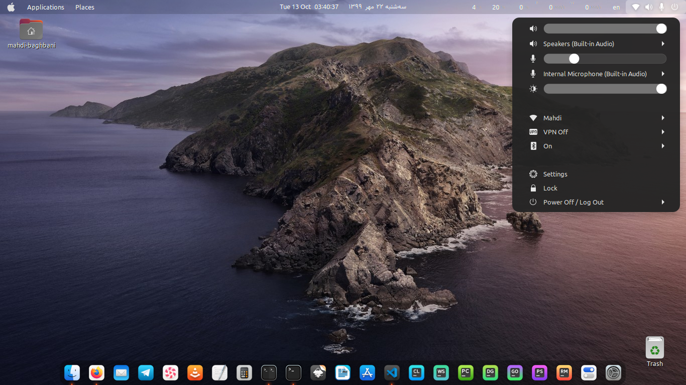

MaryamOS Theme
======

MaryamOS is a theme for gnome shell, it looks like Apple MacOS top bar.
MaryamOS includes gnome-shell, icons, cursor and plank dock themes.

## Preview

### Installation Depends requirment

- sassc.
- optipng.

Fedora/RedHat distros:

    dnf install sassc optipng

Ubuntu/Mint/Debian distros:

    sudo apt install sassc optipng

Debian 10:

    sudo apt install sassc optipng libcanberra-gtk-module libglib2.0-dev libxml2-utils

ArchLinux:

    pacman -S sassc optipng

for developers who wish to modify this theme, you need to install `inkscape` as a dependency 
to render cursor svg.

## Installation

After depends all installed you can Run

    ./install.sh

#### Install tips

Usage:  `./Install`  **[OPTIONS...]**

|  OPTIONS:           | |
|:--------------------|:-------------|
|-d, --dest           | Specify theme destination directory (Default: $HOME/.themes)|
|-n, --name           | Specify theme name (Default: MaryamOS)|
|-c, --color          | Specify theme color variant(s) **[light/dark]** (Default: All variants)|
|-o, --opacity        | Specify theme opacity variant(s) **[standard/solid]** (Default: All variants)|
|-i, --icon           | activities icon variant(s) **[standard/normal/gnome/ubuntu/arch/manjaro/fedora/debian/void]** (Default: standard variant)|
|-h, --help           | Show this help|

## Credits

- WhiteSur icon theme (https://github.com/vinceliuice/WhiteSur-icon-theme)
- McMojave-circle icon theme (https://github.com/vinceliuice/McMojave-circle)
- McMojave-cursors theme (https://github.com/vinceliuice/McMojave-cursors)
