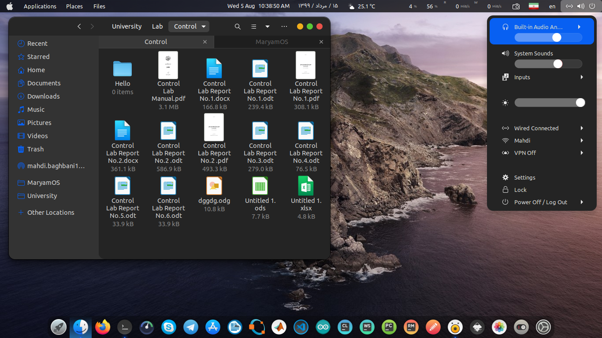

MaryamOS Theme
======

MaryamOS is a Complete Desktop Theme for Gnome and GTK 3, it looks like Apple MacOS Big Sur.
MaryamOS includes gnome-shell theme, icons and cursor themes.

## Info

- All-in-One theme for GTK 3, Gnome Shell, Icons, Cursors.
- Intended only for Gnome desktops with GTK+ 3.20 or later.
- Supports Nautilus, Nemo, LibreOffice and etc.
- Theme for Plank dock.
- High resolution wallpapers included.

## Preview

#### Light theme

#### Dark theme

#### Cursors

### Installation Depends requirment

- sassc.
- optipng.

Fedora/RedHat distros:

    dnf install sassc optipng

Ubuntu/Mint/Debian distros:

    sudo apt install sassc optipng

Debian 10:

    sudo apt install sassc optipng libcanberra-gtk-module libglib2.0-dev libxml2-utils

ArchLinux:

    pacman -S sassc optipng

for `ubuntu 18.04` `debian 10.03` `linux mint 19` and below versions you also need these:

- libglib2.0-dev.
- libxml2-utils.

Fedora/RedHat distros:

    dnf install sassc optipng libglib2.0-dev libxml2-utils

Ubuntu/Mint/Debian distros:

    sudo apt install sassc optipng libglib2.0-dev libxml2-utils

Debian 10:

    sudo apt install sassc optipng libcanberra-gtk-module libglib2.0-dev libxml2-utils

ArchLinux:

    pacman -S sassc optipng  libglib2.0-dev libxml2-utils

Other:
Search for the depends in your distributions repository or install the depends from source.

for developers who wish to modify this theme, you ned to install `inkscape` from flatpak.

    flatpak install flathub org.inkscape.Inkscape

## Installation

After depends all installed you can Run

    ./install.sh

#### Install tips

Usage:  `./Install`  **[OPTIONS...]**

|  OPTIONS:           | |
|:--------------------|:-------------|
|-d, --dest           | Specify theme destination directory (Default: $HOME/.themes)|
|-n, --name           | Specify theme name (Default: MaryamOS)|
|-c, --color          | Specify theme color variant(s) **[light/dark]** (Default: All variants)|
|-o, --opacity        | Specify theme opacity variant(s) **[standard/solid]** (Default: All variants)|
|-a, --alt            | Specify titlebutton variant(s) **[standard/alt]** (Default: All variants)|
|-s, --size           | Run a dialg to change the nautilus sidebar width size (Default: 200px)|
|    --snap           | Install modifed Snap application .desktop files to apply custom theme. (exprimental)|
|-i, --icon           | activities icon variant(s) **[standard/normal/gnome/ubuntu/arch/manjaro/fedora/debian/void]** (Default: standard variant)|
|-h, --help           | Show this help|

## Credits

- WhiteSur gtk theme (https://github.com/vinceliuice/WhiteSur-gtk-theme)
- WhiteSur icon theme (https://github.com/vinceliuice/WhiteSur-icon-theme)
- McMojave-circle icon theme (https://github.com/vinceliuice/McMojave-circle)
- McMojave-cursors theme (https://github.com/vinceliuice/McMojave-cursors)
