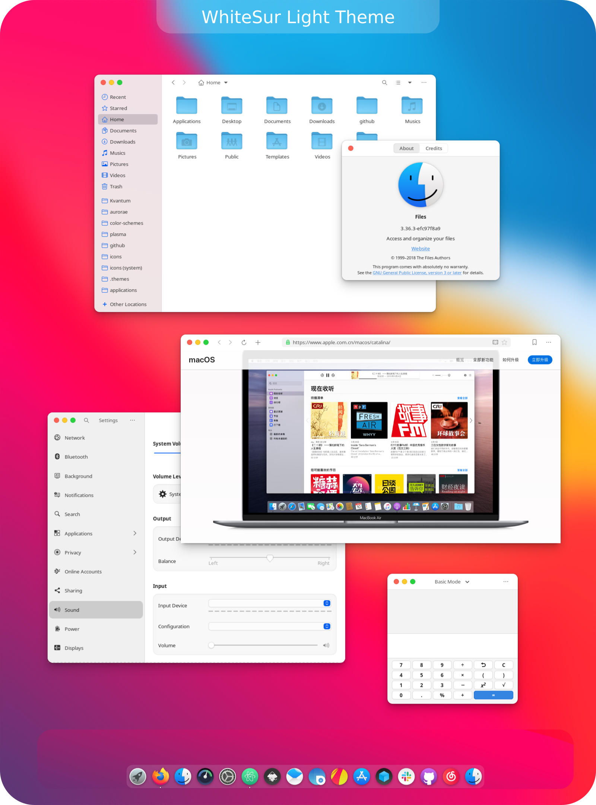
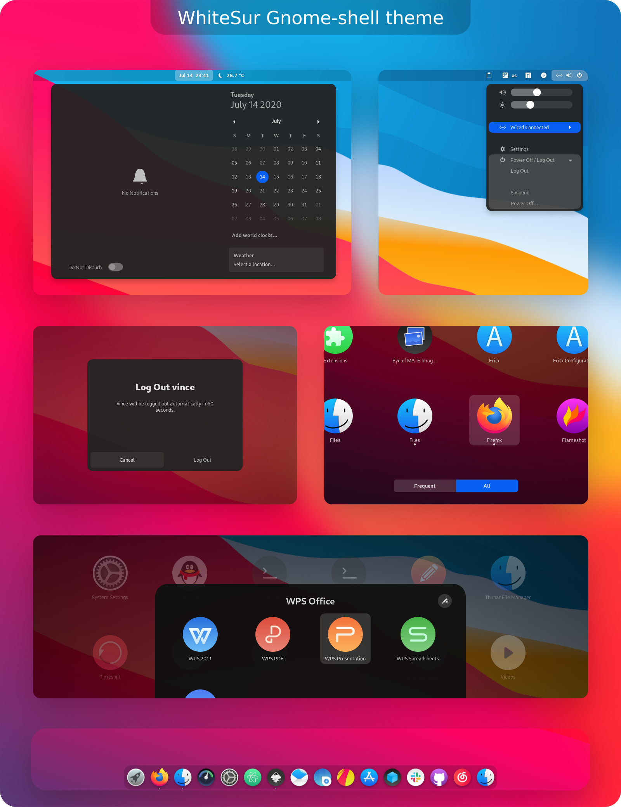

 WhiteSur Gtk Theme
======

WhiteSur is a MacOS Big Sur like theme for GTK 3, GTK 2 and Gnome-Shell which supports GTK 3 and GTK 2 based desktop environments like Gnome, Pantheon, XFCE, Mate, etc.

## Info

### GTK+ 3.20 or later

### GTK2 engines requirment
- GTK2 engine Murrine 0.98.1.1 or later.
- GTK2 pixbuf engine or the gtk(2)-engines package.

Fedora/RedHat distros:

    dnf install gtk-murrine-engine gtk2-engines

Ubuntu/Mint/Debian distros:

    sudo apt install gtk2-engines-murrine gtk2-engines-pixbuf

ArchLinux:

    pacman -S gtk-engine-murrine gtk-engines


### Installation Depends requirment
- sassc.
- optipng.
- inkscape.
- libglib2.0-dev. `ubuntu 18.04` `debian 10.03` `linux mint 19`
- libxml2-utils. `ubuntu 18.04` `debian 10.03` `linux mint 19`

Fedora/RedHat distros:

    dnf install sassc optipng inkscape

Ubuntu/Mint/Debian distros:

    sudo apt install sassc optipng inkscape

Debian 10:

    sudo apt install sassc optipng inkscape libcanberra-gtk-module libglib2.0-dev libxml2-utils

ArchLinux:

    pacman -S sassc optipng inkscape

Other:
Search for the depends in your distributions repository or install the depends from source.

## Installation

### From source

After depends all installed you can Run

    ./install.sh

#### Install tips

Usage:  `./Install`  **[OPTIONS...]**

|  OPTIONS:           | |
|:--------------------|:-------------|
|-d, --dest           | Specify theme destination directory (Default: $HOME/.themes)|
|-n, --name           | Specify theme name (Default: WhiteSur)|
|-c, --color          | Specify theme color variant(s) **[light/dark]** (Default: All variants)|
|-o, --opacity        | Specify theme opacity variant(s) **[standard/solid]** (Default: All variants)|
|-a, --alt            | Specify titlebutton variant(s) **[standard/alt]** (Default: All variants)|
|-s, --small          | Specify titlebutton size variant(s) **[standard/small]** (Default: standard variants)|
|-i, --icon           | activities icon variant(s) **[standard/normal/gnome/ubuntu/arch/manjaro/fedora/debian/void]** (Default: standard variant)|
|-g, --gdm            | Install GDM theme, you should run this with sudo!|
|-r, --revert         | revert GDM theme, you should run this with sudo!|
|-h, --help           | Show this help|

### Kde theme
[WhiteSur-kde](https://github.com/vinceliuice/WhiteSur-kde)

### Icon theme
[McMojave-circle](https://github.com/vinceliuice/McMojave-circle)

### Wallpaper
[WhiteSur default wallpapers](https://github.com/vinceliuice/Mojave-gtk-theme/blob/images/macOS_Mojave_Wallpapers.tar.xz)

### Firefox theme
[Intall Firefox theme](src/other/firefox)

## Preview




# McMojave cursors
This is an x-cursor theme inspired by macOS and
based on [capitaine-cursors](https://github.com/keeferrourke/capitaine-cursors).

## Installation
To install the cursor theme simply copy the compiled theme to your icons
directory. For local user installation:

```
./install.sh
```

For system-wide installation for all users:

```
sudo ./install.sh
```

Then set the theme with your preferred desktop tools.

## Building from source
You'll find everything you need to build and modify this cursor set in
the `src/` directory. To build the xcursor theme from the SVG source
run:

```
./build.sh
```

This will generate the pixmaps and appropriate aliases.
The freshly compiled cursor theme will be located in `dist/`

## Preview


 McMojave-circle Icon Theme
======

MacOSX Mojave like circle icon theme for linux desktops

Based on OSX_ONE: https://github.com/unc926/OSX_ONE

## Install tips

Usage:  `./install.sh`  **[OPTIONS...]**

|  OPTIONS:           | |
|:--------------------|:-------------|
|-d, --dest           | Specify theme destination directory (Default: $HOME/.themes)|
|-n, --name           | Specify theme name (Default: McMojave-circle)|
|-c, --circle         | Specify circle folder version|
|-a, --all            | Install all color folder versions|
|-w, --white          | Install white panel icon color version|
|-black               | Black color folder version|
|-blue                | Blue color folder version|
|-brown               | Brown color folder version|
|-green               | Green color folder version|
|-grey                | Grey color folder version|
|-orange              | Orange color folder version|
|-pink                | Pink color folder version|
|-purple              | Purple color folder version|
|-red                 | Red color folder version|
|-yellow              | yellow color folder version|
|-h, --help           | Show this help|

#### For example

`./install.sh` : install default color version

`./install.sh -black` : install black color versions

`./install.sh -a` : install all color versions

`./install.sh -c` : install circle folder version

## Requirment
You can use this with:

### GTK theme

Mojave-gtk-theme: https://github.com/vinceliuice/Mojave-gtk-theme

### KDE theme

McMojave-kde: https://github.com/vinceliuice/McMojave-kde

### folder-color
folder-color: http://foldercolor.tuxfamily.org

## Preview


