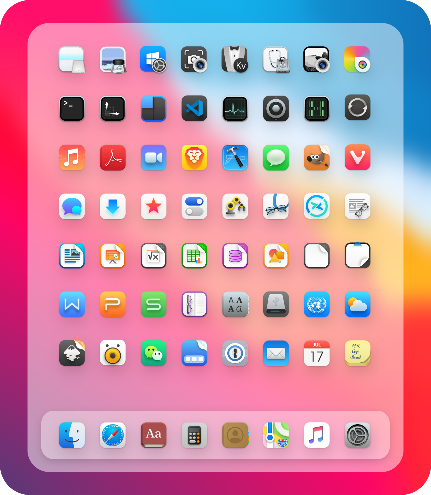
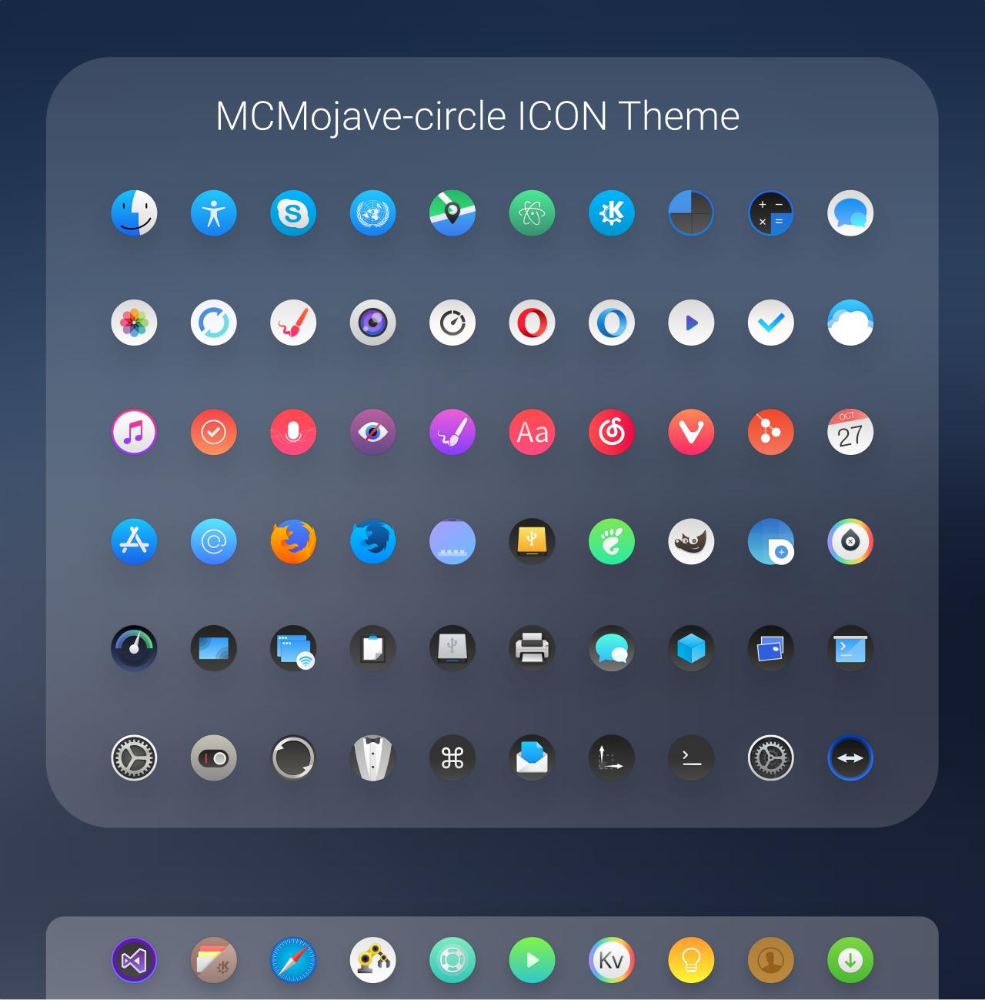

MaryamOS Gtk Theme
======

MaryamOS is a MacOS Big Sur like theme for GTK 3 and Gnome-Shell which supports GTK 3 based desktop environments like Gnome.

MaryamOS includes an x-cursor theme inspired by macOS and
based on [capitaine-cursors](https://github.com/keeferrourke/capitaine-cursors) and also
icludes MacOSX Mojave like circle icon theme for linux desktops.

## Info

- All-in-One theme for GTK, Gnome Shell, Icons, Cursors and Grub menu.
- Intended only for Gnome desktops with GTK+ 3.20 or later.
- Supports Nautilus, Nemo, LibreOffice and etc.
- Minimus support for Budgie and UNity desktops [not tested].
- Minimum support for lightdm [not tested].
- High resolution wallpapers included.

### Installation Depends requirment

- sassc.
- optipng.

Fedora/RedHat distros:

    dnf install sassc optipng

Ubuntu/Mint/Debian distros:

    sudo apt install sassc optipng

Debian 10:

    sudo apt install sassc optipng libcanberra-gtk-module libglib2.0-dev libxml2-utils

ArchLinux:

    pacman -S sassc optipng

for `ubuntu 18.04` `debian 10.03` `linux mint 19` and below versions you also need these:

- libglib2.0-dev.
- libxml2-utils.

Fedora/RedHat distros:

    dnf install sassc optipng libglib2.0-dev libxml2-utils

Ubuntu/Mint/Debian distros:

    sudo apt install sassc optipng libglib2.0-dev libxml2-utils

Debian 10:

    sudo apt install sassc optipng libcanberra-gtk-module libglib2.0-dev libxml2-utils

ArchLinux:

    pacman -S sassc optipng  libglib2.0-dev libxml2-utils

Other:
Search for the depends in your distributions repository or install the depends from source.

## Installation

### From source

After depends all installed you can Run

    ./install.sh

#### Install tips

Usage:  `./Install`  **[OPTIONS...]**

|  OPTIONS:           | |
|:--------------------|:-------------|
|-d, --dest           | Specify theme destination directory (Default: $HOME/.themes)|
|-n, --name           | Specify theme name (Default: MaryamOS)|
|-c, --color          | Specify theme color variant(s) **[light/dark]** (Default: All variants)|
|-o, --opacity        | Specify theme opacity variant(s) **[standard/solid]** (Default: All variants)|
|-a, --alt            | Specify titlebutton variant(s) **[standard/alt]** (Default: All variants)|
|-s, --small          | Specify titlebutton size variant(s) **[standard/small]** (Default: standard variants)|
|-i, --icon           | activities icon variant(s) **[standard/normal/gnome/ubuntu/arch/manjaro/fedora/debian/void]** (Default: standard variant)|
|-g, --gdm            | Install GDM theme, you should run this with sudo!|
|-r, --revert         | revert GDM theme, you should run this with sudo!|
|-h, --help           | Show this help|

## Preview

